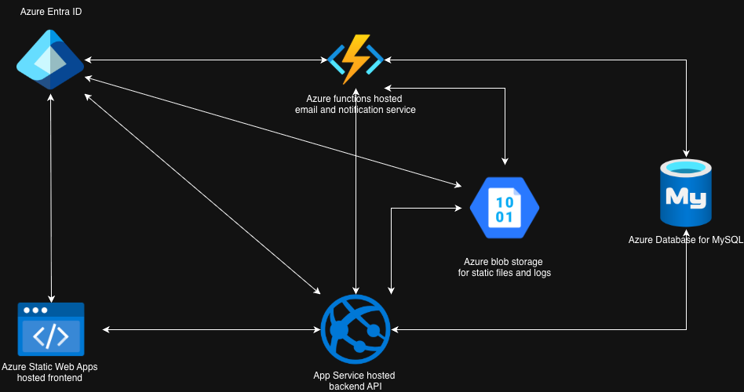
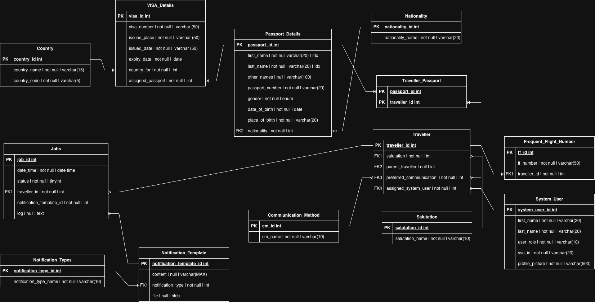

# 🌌 SkyVault

**SkyVault** is a cloud native application of a CMS designed for a travel agencies. It securely stores traveler information, automates notifications, and helps agencies streamline their customer relationship processes.
In this repository only the backend API source code can be found. 
> ⚠️ **Disclaimer:** This is a portfolio project. It is **not intended for public use**, modification, distribution, or commercial purposes.

---

👉  [SkyVault Cloud Functions](https://github.com/sanuja-ariyapperuma/Skyvault-CloudFunctions)

---

## 🚀 Features

* **Azure AD Authentication** – Seamless integration with organizations already using Microsoft Entra ID.
* **Traveler Information Management** – Store and manage customer details, including:

    * Name and contact information
    * Passport information
    * Visa details
    * Frequent flyer numbers
* **Automated Notifications** – Sends emails to customers for important events, including:

    * Passport expiry reminders
    * Visa expiry alerts
    * Birthday wishes
    * Travel offers and urgent announcements

  > Notifications are sent via an external Azure Function hosted separately.
* **Portfolio-Only Project** – Code is not intended for public use, modification, or distribution.

---

## 💻 Tech Stack

  
  
  
  
  
  
  
  
  

---
## Cloud Architecture

---
## ER Diagram

---

## ⚙️ Setup (Optional, Portfolio Use Only)

> This project is not meant to be deployed or used. For portfolio purposes, here’s a high-level setup overview:

1. Clone the repository.
2. Configure Azure AD for authentication.
3. Install MySQL / MariaDB or set up Azure Database for MySQL and configure EF Core.
4. Run the project locally or deploy the API to Azure App Service.
5. Configure external Azure Function for sending notifications.

---

## 📧 Notifications

The system can automatically send emails in these scenarios:

* Passport expiration
* Visa expiration
* Birthday wishes
* Special offers or urgent travel notifications

> Email notifications rely on an external Azure Function hosted separately.

---

## ⚠️ Disclaimer

This repository is strictly a portfolio project. **Do not use, modify, distribute, or sell the code.**
