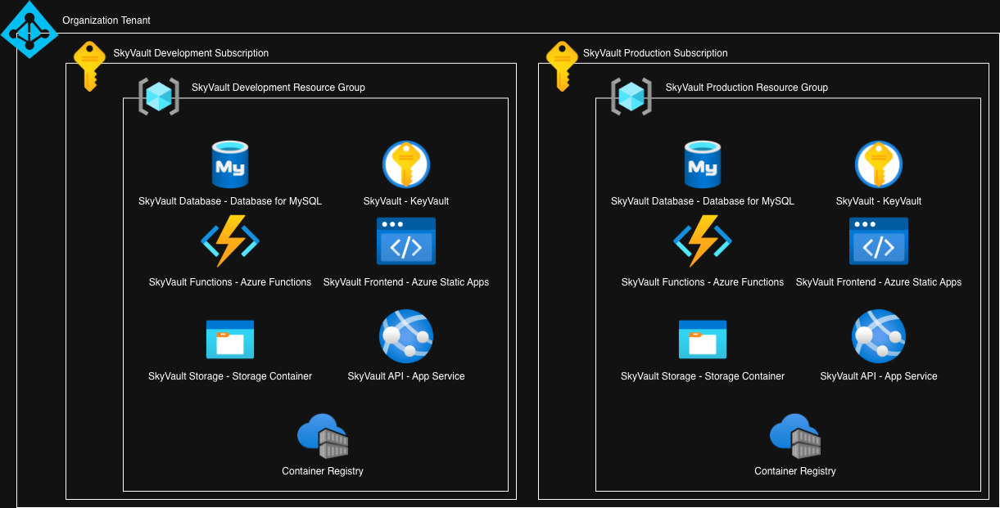
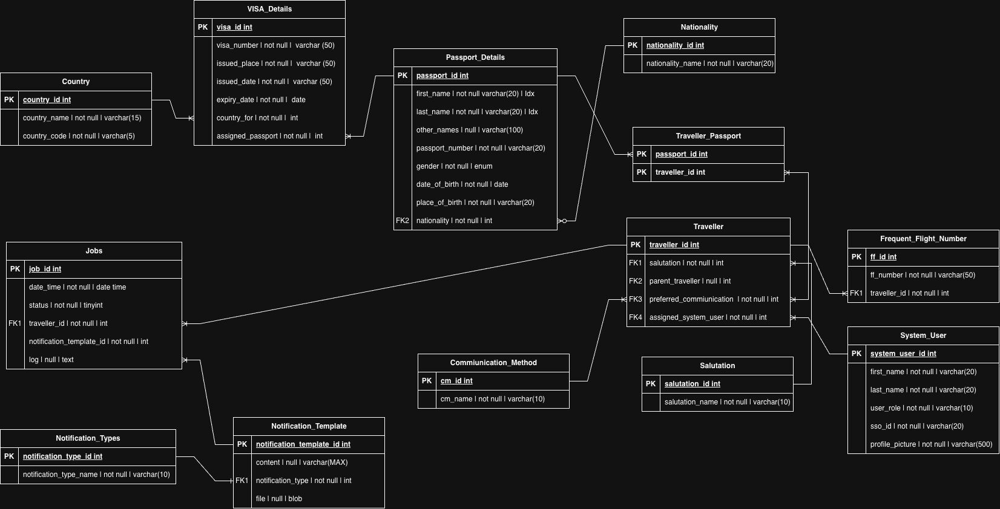

# 🌌 SkyVault

**SkyVault** is a cloud native application of a CMS designed for a travel agencies. It securely stores traveler information, automates notifications, and helps agencies streamline their customer relationship processes.
In this repository only the backend API source code can be found. 
> ⚠️ **Disclaimer:** This is a portfolio project. It is **not intended for public use**, modification, distribution, or commercial purposes.

---

👉  [SkyVault Cloud Functions](https://github.com/sanuja-ariyapperuma/Skyvault-CloudFunctions)

---

## 🚀 Features

* **Azure AD Authentication** – Seamless integration with organizations already using Microsoft Entra ID.
* **Traveler Information Management** – Store and manage customer details, including:

    * Name and contact information
    * Passport information
    * Visa details
    * Frequent flyer numbers
* **Automated Notifications** – Sends emails to customers for important events, including:

    * Passport expiry reminders
    * Visa expiry alerts
    * Birthday wishes
    * Travel offers and urgent announcements
*  **User Roles** – There are three different user roles used in the system.  
    * Super Admin – Have the authority to perform critical changes. Can assign customer profiles to users
    * Admin – Have the authority to edit / delete customer profiles
    * Staff - Can view / edit (only for limited time) records but only belongs to him or her

  >   Notifications are sent via an external Azure Function hosted separately.
* **Portfolio-Only Project** – Code is not intended for public use, modification, or distribution.

---

## 💻 Tech Stack

  
  
  
  
  
  
  
  
  

---
## ☁️ Azure Cloud Architecture

### Azure-Native Design

The SkyVault solution is designed to host easily on Azure with enterprise-grade security and scalability. The architecture leverages Azure's native capabilities to provide seamless integration with existing Microsoft ecosystems.

#### **Authentication & User Management**
- **Microsoft Entra ID Integration** - Users can log in with the same credentials they use for Microsoft 365
- **Tenant-Based Access** - Application is configured under designated Azure tenant
- **Role-Based Assignment** - Tenant users are assigned to the application with appropriate permissions

#### **Resource Organization**
- **Dedicated Subscription** - All SkyVault resources hosted in a separate subscription for billing clarity
- **Resource Group Isolation** - Logical grouping of all related Azure resources
- **Cost Management** - Simplified billing and resource tracking through dedicated subscription

#### **Infrastructure as Code**
- **Bicep Templates** - Complete IaC solution available for automated provisioning
- **Declarative Deployment** - Infrastructure defined as code for consistency and repeatability
- **Environment Parity** - Easy replication across development, staging, and production environments

#### **Security Architecture**
- **Managed Identity Communication** - All Azure services communicate using managed identities
- **Key Vault Integration** - Secure credential storage and retrieval
- **Database Security Pattern**:
  - App Service and Azure Functions authenticate to Key Vault using managed identity
  - Database credentials retrieved from Key Vault
  - Normal connection string used for MySQL database connectivity
- **Network Isolation** - Database has no internet access, only allows inbound traffic from App Service and Azure Functions

#### **Deployment & Scalability**
- **Container Registry** - Application images stored in Azure Container Registry
- **Rapid Scaling** - Easy to spin up new app instances or complete resource sets
- **Consistent Deployment** - Same container image ensures identical environments across deployments

#### **Azure Service Integration**
- **App Service** - Hosts the main application with auto-scaling capabilities
- **Azure Database for MySQL** - Isolated database with restricted network access
- **Key Vault** - Centralized secret management
- **Azure Functions** - Separate microservice for notifications and background processing
- **Azure Container Registry** - Image repository for deployment consistency

---
## ER Diagram

---

## ⚙️ Setup (Optional, Portfolio Use Only)

> This project is not meant to be deployed or used. For portfolio purposes, here’s a high-level setup overview:

1. Clone the repository.
2. Register the API in desired tenant.
3. Set environment variables accordingly.
4. Use docker to spin-up run the app.
5. Apply migrations and seeds
6. API will be fully functional.

---

## 📧 Notifications

The system is possible for:

* Maintain customer information (Personal, Passport, Frequent Flyer, Visa)
* Define Birthday wishes, notifications for clients
* Broadcast marketing campaigns or special messages to client 

> Email notifications rely on an external Azure Function hosted separately.

👉  [SkyVault Cloud Functions](https://github.com/sanuja-ariyapperuma/Skyvault-CloudFunctions)

---

## ⚠️ Disclaimer

This repository is strictly a portfolio project. **Do not use, modify, distribute, or sell the code.**
